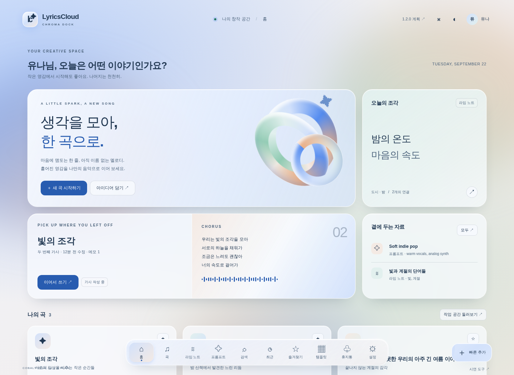

# 1.2.0 — Chroma Dock · Cobalt Blue 리디자인

상태: **P1·P2·P3 완료 / P4 진행 중 / P5 미착수**. 2026-09-22 사용자 선택을 반영한 리디자인 계획이다. 목업/원 리뷰의 출처는 `v1.1.7a` / `fc2463cdb47d9fd7d0042779f602c6ddb7d734cf`다. 실제 구현 출발점은 [1.1.7b 웹 통합](../1.1.7.b/HANDOFF-TO-1.2.0.md)의 P5 기능 SHA `acd2bd99876740debf426c401fe7157713f8b854`다. native 1.1.8~1.1.14는 보류하며 웹 수정은 b에서 선별 통합했다. [전환 결정](../PLAN-CHANGE.md)과 [실행 상태](<../../1. Dev-phase/STATUS.md>)를 함께 읽는다.

## 선택한 목업

**[코발트 블루 Chroma Dock 실행형 목업 열기](mockup/index.html)**

[어두운 화면](mockup/index.html?theme=dark) · [가사 편집](mockup/index.html#lyric/l1) · [목업 코드·검증 안내](mockup/README.md)

선택안은 10색 비교 중 **04 Cobalt**다. 코발트 `#568DF0`를 중심으로 민트 `#91CBB3`와 살구 `#EAAF88`의 반사광을 조합한다. 하단 도크와 모듈형 공간, 자연스러운 다색 그라데이션·유리·블러·입체감은 유지하고 라임 노트·프롬프트·자료 탭을 기능 단위로 보존한다. 제품에는 10개 시안 선택 도구를 추가하지 않는다.

## 목표와 포함 범위

1. 웹/PWA의 홈·공통 탐색·목록·편집·설정·공유·복구 화면을 하나의 코발트 light/dark 디자인으로 일관되게 적용한다.
2. 가사·라임·프롬프트의 모든 기존 작성·탐색·연결·복사 기능과 CodeMirror/Yjs 입력·저장 계약을 유지한다.
3. PC·좁은 화면·모바일 키보드·터치·키보드 탐색과 투명도/동작 감소 환경을 함께 설계한다.
4. 선정 목업을 공통 토큰·실제 컴포넌트로 옮기고, 이전 UI로 되돌려도 기존 창작물과 설정이 보존되는 전환을 제공한다.

UI 교체를 이유로 DB schema/API/protocol을 재설계하거나 실제 기능을 목업의 로컬 시연 코드로 대체하지 않는다. 데이터 구조 변경이 꼭 필요하면 해당 소비 Phase 전에 이유·호환·복구와 추가 검증을 별도 기록한다.

## 다섯 Phase

| Phase | 범위 | 핵심 산출물 |
|---|---|---|
| [P1](1phase.md) | 기준·기능 보존·전환 계약 | 실제 1.1.7a 화면/기능 대응표, 토큰·효과·rollback 계약, 테스트 기대값 |
| [P2](2phase.md) | 색상 토큰·공통 셸·탐색과 목록 | 코발트 양 테마, PC 도크·모바일 탐색, 홈·목록·검색/필터/순서 |
| [P3](3phase.md) | 편집·자료·설정·공유와 복구 | 가사/라임/프롬프트 편집, 자료 4탭, 프로필/화면 설정, 모달/복구 |
| [P4](4phase.md) | 교차 회귀·접근성·성능 | 입력·동기화·권한·반응형·효과 fallback·지원 브라우저/실기기 구분 결과 |
| [P5](5phase.md) | 문서·최종 통합·개발 인수 | 요구 대응표·최종 CI·같은 SHA 개발 smoke·릴리스 인계와 되돌림 |

각 Phase는 이전 Phase의 실제 인수 뒤 시작한다. 문서에 적힌 Phase와 목업 검증을 제품 Phase 완료로 표시하지 않는다. [Agent.md](../../../Agent.md)의 완료 순서와 [기존 품질 게이트](../../2.Patch-phase/QUALITY-GATES.md)를 적용한다.

## 설계·수용 기준

- [DESIGN-SPEC.md](DESIGN-SPEC.md): 색·표면·도크·반응형·동작과 제품 이식 기준.
- [ACCEPTANCE.md](ACCEPTANCE.md): 화면 범위, `RD-REQ-*`와 `AC-RD-120-*`, Phase별 소유권과 실패 조건.
- [FEATURE-MAP.md](FEATURE-MAP.md): 목업의 207개 고유 ID를 현행 route/컴포넌트와 담당 Phase에 연결한 P1 대응표. 대응은 동작 PASS가 아니다.
- [목업 기능 데이터](mockup/base/feature-data.js): 기존 E의 207개 기능 설명을 보존한 시연 인벤토리. 제품의 실제 구현 증거는 P1에서 원본 코드와 다시 대조한다.
- [계획·목업 검증 기록](../VERIFICATION.md): 이번 문서 작업의 확인 결과와 실제 제품 구현에서 남은 검사.

## 범위 밖과 인수 주의점

1.1.8~1.1.14의 Windows/Android/Linux/macOS/iOS 네이티브 개발·패키징은 보류다. 기존 사전 provider·자동 Suno metadata 등 외부 조건이 닫히지 않은 기능을 이 디자인 선택만으로 구현 완료로 간주하지 않는다. 새로운 인증 방식·공유 정책·요금·모바일 앱 스토어 배포는 이번 범위가 아니다.

이전 B-1 적용과 현재 기능은 과거 승인·실행 이력으로 보존한다. 새 외형은 이 선정안을 따르되, 기존 route·return 흐름·계정별 설정·공유 권한·데이터는 실제 계약을 기준으로 이식한다. 이전 리뷰 원문이나 비공개 운영 자료 전체를 이 폴더에 복사하지 않는다.

## 1.2.1 이후 연결·웹 안정화 선별 인수

후속은 [1.2.1~1.2.8 로드맵](../ROADMAP.md)으로 확정해 관리한다. 0922 리뷰의 [선행 차단 목록](../QUALITY-GATES.md)과 [1.1.8 P4 웹 안정화 비교](../BRANCH-COMPARISON-118-P4.md)를 P1/P4/P5에서 소비한다. WC-02 입력 보존, WC-03 탐색 보호, WC-11 focus/반응형, WC-12 구 탭/PWA 전환 등은 새 디자인의 기능 보존에 직접 관련된다.

원격에 구현된 후보는 의존성·native/1.1.8 metadata 혼입을 검토하고 최소 웹 변경과 회귀만 새 후보에서 인수한다. 코발트 시안·현재 실행 STATUS를 원격의 이전 계획으로 교체하지 않는다. 후속 번호 배정만으로 원문 손실·거짓 저장·권한/운영 gate를 면제하지 않는다.
