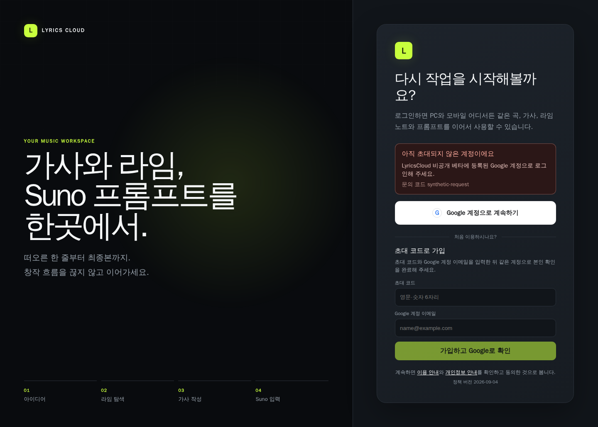
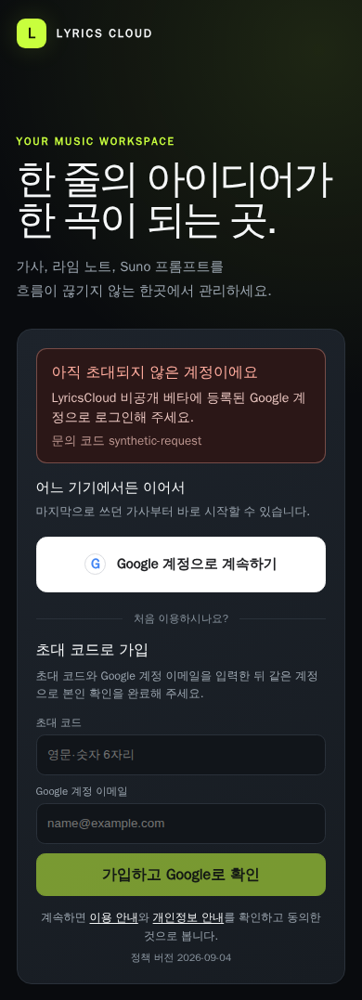

<p align="center">
  <picture>
    <source media="(prefers-color-scheme: dark)" srcset="apps/web/public/icons/lyricscloud-mark-dark.svg">
    
  </picture>
</p>

# LyricsCloud

[](https://github.com/parking-place/LyricsCloud/actions/workflows/ci.yml)

LyricsCloud는 곡, 여러 가사 버전, 라임 노트와 Suno 프롬프트를 한곳에서 관리하는 셀프호스트 웹 앱이다. PC 집중 편집, 모바일 확인·수정·복사, 같은 계정의 여러 기기·탭 자동 병합, 지정 사용자 읽기 공유와 온라인 우선 PWA를 지원한다.

현재 운영 서버의 정식 릴리스는 [`v1.0.14`](https://github.com/parking-place/LyricsCloud/releases/tag/v1.0.14)이며 소스는 `1.1.0` Phase 5 후보다. 1.1.0은 로그인한 지정 사용자에게 특정 가사만 읽기로 공유하는 첫 다중 사용자 경계를 제공한다.

## 주요 기능

- 곡 CRUD, 상태·메모·필터·즐겨찾기·핀과 곡 중심 대시보드
- 곡별 Suno 모델명과 최대 20개 수동 작업 링크·제목·메모·순서 저장, 보호된 새 탭 열기
- 곡·라임 노트·프롬프트의 drag·버튼·키보드 사용자정렬, 모바일 copy gesture 분리와 계정별 순서 복원
- 곡·라임 노트·프롬프트 목록의 리스트·소/중/대 그리드와 계정·자료유형별 보기 저장
- CodeMirror 기반 한글 가사 편집, `[TAG:sub tag]` 탐색, Extend 원문/Suno 복사 분리, PC 우클릭·키보드·모바일 송폼 삽입, 전체·구간 복사와 3,000자 초과 안내, 수정 기록 비교·복원
- 같은 owner의 브라우저·기기·탭 CRDT 병합, 계정별 offline 초안과 재연결 복구
- 라임 노트와 태그형·문장형 Suno 프롬프트 작성, 원문 보존 변환·마침표 구간 표시·최종 복사 1,000자 초과 안내
- 통합 검색, 최근 작업·위치 복원, 템플릿, 표시 설정과 키보드 명령
- 30일 휴지통, 탈퇴 철회, TXT/Markdown+JSON 전체 ZIP 내보내기
- 설치형 PWA, light/dark 테마, 접근 가능한 PC·모바일 화면
- 계정·가사별 Noto Sans KR 선택, same-origin immutable/PWA cache와 system sans fallback
- 계정별 비열거 공유 코드, 특정 가사 selected-read, 읽기 전용 live update·최소 presence·즉시 권한 회수
- Google OIDC와 1회성 초대 코드 기반 Private Beta 가입

public link·guest·쓰기 공동 편집, AI 생성, 미디어 업로드는 1.1.0 범위가 아니다.

## 현재 상태

| 항목 | 상태 |
|---|---|
| 소스·runtime version | `1.1.0` |
| 현재 작업 | [1.1.0 Phase 5 — 문서·개발 인수·후속 연결](<./0.Plans/2.Patch-phase/1.1.0/5phase.md>) |
| 실행 상태 원본 | [STATUS.md](<./0.Plans/1. Dev-phase/STATUS.md>) |
| 정식 릴리스 | `v1.0.14`, main/tag `d093ff2`, exact digest 운영 배포·공개 재시작/영속성 smoke 완료 |
| 개발 인수 | 1.1.0 P1~P4 동일 SHA 개발 인수 완료; P5 최종 봉인·개발 인수 진행 |
| 운영 제한 | 외부 암호화 backup·24시간 RPO·복원 훈련은 사용자 승인 예외로 아직 미구축 |

1.1.0은 owner와 actor를 분리하고 자료별 read grant를 사용한다. reader는 지정 가사의 제목·본문·상태와 최소 presence만 보며 메모·연결 자료·다른 가사·revision·owner API는 볼 수 없다. 회수·만료는 열린 연결과 이후 API를 함께 차단한다.

## 화면

신규 사용자는 초대 코드와 Google 계정 이메일을 입력하고, 같은 계정의 Google 본인 확인을 마쳐야 코드 소비와 접근권 등록이 함께 완료된다. 아래는 실제 계정·코드가 없는 합성 검증 화면이다.

<p align="center">
  
</p>

<p align="center">
  
</p>

## 빠른 시작

로컬 개발에는 Node.js 24, pnpm 11, Docker Engine와 Compose가 필요하다.

```bash
cp .env.example .env
cp .test_users.example .test_users
# CHANGE_ME 값을 설정하고 HMAC allowlist 전환 절차를 완료한 뒤
docker compose config --quiet
docker compose up --build --wait
curl --fail http://127.0.0.1:8080/api/health/ready
```

기본 주소는 `http://localhost:8080`이다. 일반 종료는 `docker compose down`이며 DB volume은 보존된다. `docker compose down --volumes`는 자료를 삭제하므로 disposable 초기화 환경 외에는 실행하지 않는다.

운영 설치·HTTPS·OAuth·secret·upgrade 설정은 [셀프호스팅 안내](./docs/self-hosting.md)를 처음부터 따른다.

## Private Beta 운영

P2 관리자 CLI는 초대 코드 발급·조회·전체 교체를 제공한다. 원문 코드와 키를 명령 인수, 로그, Issue 또는 Git에 넣지 않는다.

```bash
LyricsCloud betacode -n 10
LyricsCloud betacode ls
LyricsCloud betacode refresh
```

정확한 입력·출력·동시성·복구 계약은 [Beta 관리자 runbook](./docs/runbooks/1.0.1-phase2-beta-admin.md), 기존 계정 HMAC 전환은 [allowlist runbook](./docs/runbooks/1.0.1-phase3-hmac-allowlist.md), Google 설정은 [OAuth runbook](./docs/runbooks/google-oauth-setup.md)을 따른다.

## 보안·백업 경계

창작물은 PostgreSQL에, 전송 전 offline 초안은 계정별 브라우저 저장소에 둔다. 로그와 관측에는 제목·본문·태그·프롬프트·검색어·이메일·OAuth/session 값과 동적 resource ID를 넣지 않는다. 전체 내보내기는 이동용 사본이며 운영 backup을 대신하지 않는다.

실제 `.env`, `.test_users`, DB volume, backup archive·identity, export와 창작물은 Git에 넣지 않는다. 현재 공식 릴리스 서버의 외부 backup은 미구축 상태이며 호스트 손실 시 복구 지점을 보장하지 않는다. 구축 전에는 이 위험과 승인 예외를 각 릴리스 기록에 명시한다. 취약점은 공개 Issue가 아닌 [비공개 보안 보고 절차](./SECURITY.md)를 사용한다.

## 문서

| 대상 | 문서 |
|---|---|
| 사용자 | [사용자 안내](./docs/user-guide.md), [지원 환경·알려진 제한](./docs/support.md) |
| 셀프호스트 운영자 | [설치·설정·health·upgrade](./docs/self-hosting.md), [Docker 구성](./infra/docker/README.md) |
| 인증·베타 운영자 | [Google OAuth](./docs/runbooks/google-oauth-setup.md), [초대 코드 CLI](./docs/runbooks/1.0.1-phase2-beta-admin.md), [HMAC allowlist](./docs/runbooks/1.0.1-phase3-hmac-allowlist.md) |
| 복구·배포 담당자 | [backup·restore·upgrade·rollback](./docs/runbooks/backup-restore-upgrade.md), [개발 배포](./docs/runbooks/development-deploy.md), [Docker Hub 발행](./docs/runbooks/dockerhub-publish.md) |
| 보안·장애 담당자 | [Security policy](./SECURITY.md), [경보 대응](./docs/runbooks/observability-alerts.md), [사고 기록 양식](./docs/runbooks/incident-record-template.md) |
| 릴리스 검토자 | [1.1.0 release notes](./docs/releases/1.1.0.md), [1.1.0 Phase 5](./docs/runbooks/1.1.0-phase5-final-acceptance.md), [1.1.0 추적](./docs/architecture/1.1.0-FINAL-TRACEABILITY.md), [CHANGELOG.md](./CHANGELOG.md) |
| 기여자 | [Agent 지침](./Agent.md), [후속 계획](./0.Plans/2.Patch-phase/README.md), [ADR 색인](./docs/adr/README.md) |

## 저장소 구조

| 경로 | 역할 |
|---|---|
| `apps/` | web, collaboration, worker runtime |
| `packages/` | auth, database, domain, editor, observability, UI |
| `tests/` | 통합·E2E·owner 격리·브라우저 회귀 |
| `infra/` | production image와 backup 도구 |
| `config/` | 환경·migration·artifact·성능·경보 계약 |
| `docs/` | 사용자·셀프호스트·ADR·보안·운영 runbook |
| `scripts/` | 검증·migration·배포 보조 명령 |
| `0.Plans/` | 보호된 기획·목업·기술 결정과 Phase 상태 |

Suno 자동 메타데이터·사전·public/write 공유·native 앱 후보는 [최신 요구 대응표](./docs/planning/latest-requirements-mapping.md)에 분리되어 있다. 1.1.0은 selected-read만 제공하고 이후 공유 범위는 1.1.1~1.1.4가 단계적으로 담당한다.
