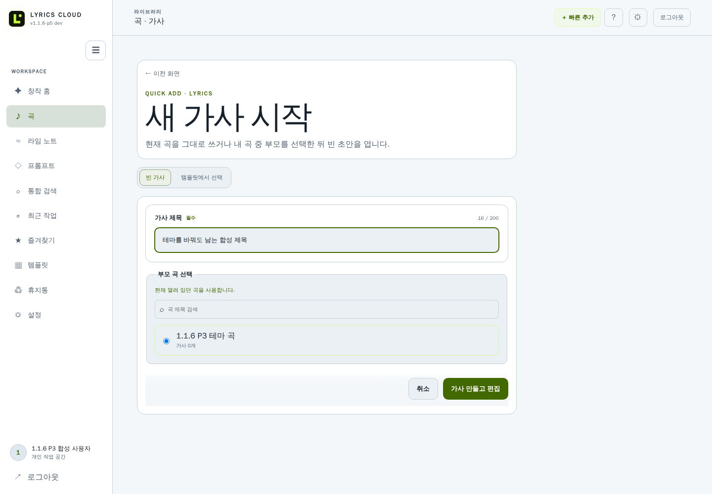
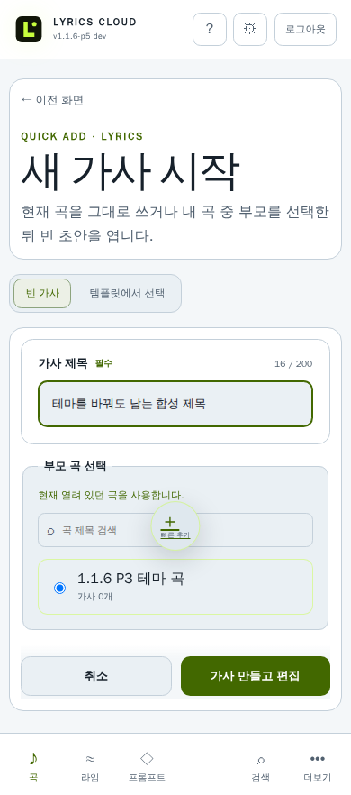
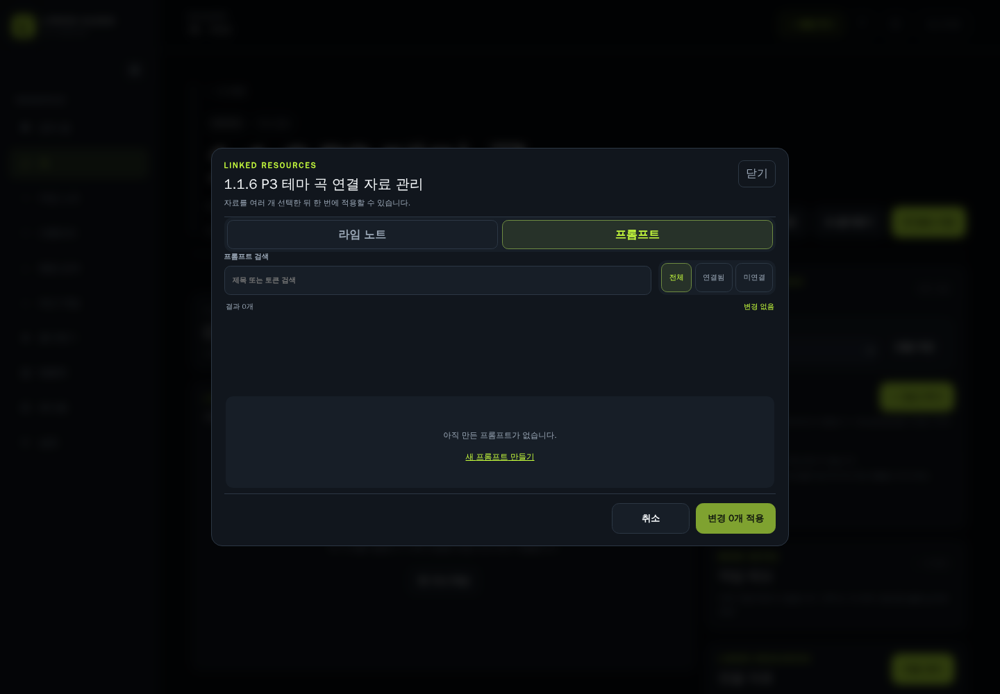
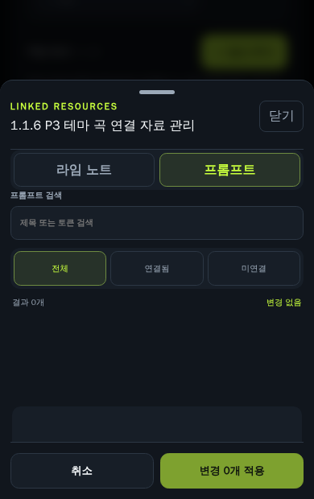

# 1.1.6 창작 화면과 복구 안내

1.1.6의 창작 화면은 라이트·다크 모드에서 같은 기능과 상태를 유지합니다. 아래 이미지는 자동 검증용 합성 계정과 합성 문구만 사용한 실제 구현 화면입니다.

## 새 가사 시작

곡 화면의 `＋ 새 가사` 또는 빠른 추가의 `새 가사`를 선택합니다. 제목과 부모 곡을 확인한 뒤 `가사 만들고 편집`을 누르면 서버 초안이 생성되고 편집 화면으로 이동합니다.

- 테마나 화면 폭이 바뀌어도 현재 입력은 그대로 유지됩니다.
- 서버 응답을 확인하지 못하면 입력과 요청 식별자를 유지한 채 같은 요청을 다시 확인합니다.
- 부모 곡이 삭제됐거나 권한이 없으면 다른 곡을 선택하라는 안내가 표시됩니다.

## 라임·프롬프트 초안

새 라임 노트와 새 프롬프트는 먼저 이 기기의 계정별 초안에 저장됩니다. 유효한 제목을 입력하면 서버 문서로 전환됩니다.

- 오프라인이어도 입력을 계속할 수 있으며, 상태 문구에서 로컬 저장 여부를 확인할 수 있습니다.
- `취소`를 누르면 삭제 확인 대화상자가 열립니다. `Escape` 또는 `계속 작성`으로 닫으면 원래 버튼으로 초점이 돌아오고 입력은 남습니다.
- 초안을 지우려면 확인 대화상자의 `초안 삭제 후 나가기`를 선택합니다.

## 연결 자료 관리

곡 화면의 `연결 관리`에서 라임 노트와 프롬프트를 검색하고 여러 항목을 한 번에 연결하거나 해제할 수 있습니다.

- 불러오는 중, 결과 없음, 오류와 재시도 상태가 대화상자 안에 표시됩니다.
- 연결 해제는 자료 삭제가 아니며, 적용 전에 별도 확인을 거칩니다.
- `Escape`, `닫기`, `취소`로 닫으면 `연결 관리` 버튼으로 초점이 돌아옵니다.
- 모바일에서는 하단 시트로 표시되며 화면 하단 안전 영역과 가상 키보드 공간을 침범하지 않습니다.

## 저장·권한·복구 상태 읽기

- `방금 저장됨`은 서버 저장 응답이 확인된 상태입니다.
- 저장 실패나 권한 회수 뒤 남은 입력은 화면의 복구 영역에서 복사하거나 내려받을 수 있습니다.
- 공유 권한이 회수되면 더 이상 서버에 쓰지 않으며, 미전송 입력을 다른 계정이나 문서로 자동 전송하지 않습니다.
- 가입 코드 오류와 탈퇴 재인증 오류는 입력을 숨기지 않고 같은 화면에서 재시도 경로를 제공합니다.

실제 iOS·Android 물리 키보드, 운영체제 IME와 보조 기술 검증은 브라우저 자동 검증과 구분해 1.1.6 P4/P5에서 기록합니다.
